# RealEstate Market

## Student Information
**Student ID:** IT21070358  
**Student Name:** Thihan D.P.D

## 01. Project Description
RealEstate Market is a comprehensive application designed for the real estate sector. It allows real estate agents to manage property listings and potential buyers to explore and inquire about properties. The app integrates MapKit for displaying property locations on an interactive map and features an admin panel for real estate agents to manage property ads.

## 02. Users of the System
- **Real Estate Agents:** Manage property listings, including adding, updating, and deleting properties.
- **Buyers:** Browse property listings, view detailed property information, and contact agents.
- **Admin:** Oversee all functionalities and manage users and listings.

## 03. Unique Features
- **MapKit Integration:** Provides a map view of property locations for better geographical context.
- **Comprehensive Admin Panel:** Empowers agents to efficiently manage property listings.
- **Real-time Data Fetching:** Ensures up-to-date property information using Firebase.
- **User-Friendly Interface:** Features horizontal scrolling of property listings and well-organized property details.

## 04. Screens and Functionality

### Home Screen
The home screen welcomes users to the RealEstate Market app. It features:
- A navigation bar to navigate through the pages
- An image slider displaying property images
- Sections for the most valuable properties and new listings(Star Mark)
- Horizontal scrolling through property listings
- Homes and lands categories.

### Property Details Screen
This screen displays detailed information about a selected property, including:
- Price
- Description
- Location
- Size
- Other relevant details

### Properties list view
This shows all properties in a list to make easy to users to view adds
  
### Map Screen
This shows property location and directions on a map using MapKit integration

### RealEstate Agent Panel Screen
The admin panel allows real estate agents to manage their property listings:
- Add new properties
- Update existing properties
- Delete properties that are no longer available
- View added properties
  
## Image Gallery

| Home Screen | Detail Properties | Detail Properties Directions |
|-------------|-------------|------------------------|
| 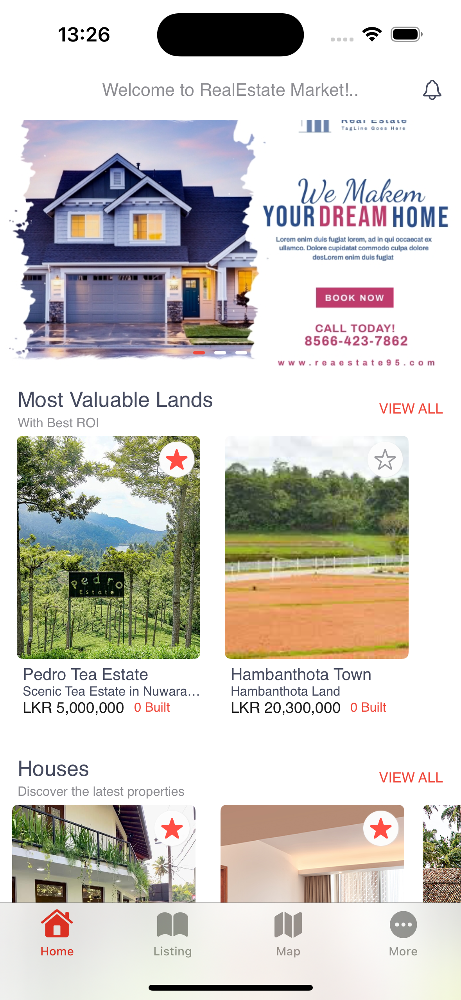 | 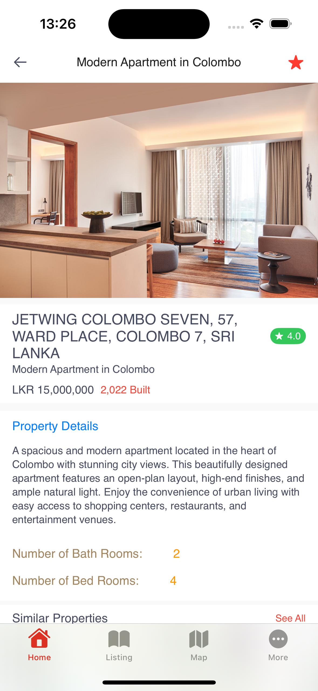 | 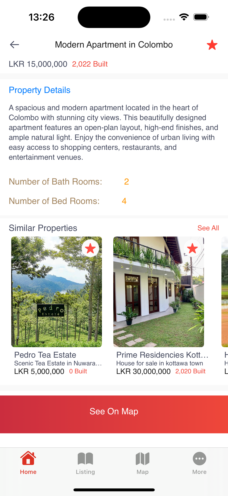 |
| List Properties | Map Street View | Dirrections to Propertie |
| 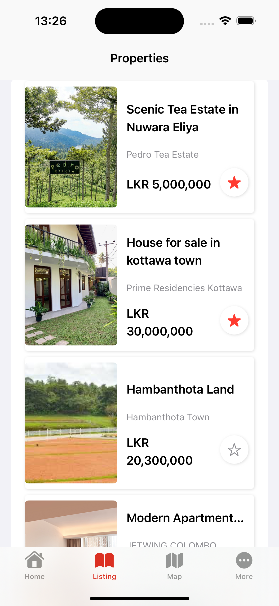 | 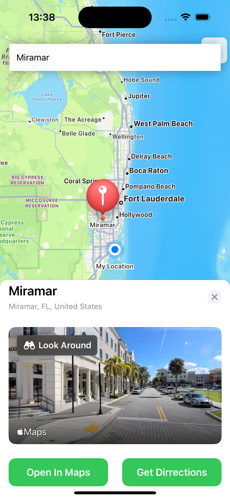 | 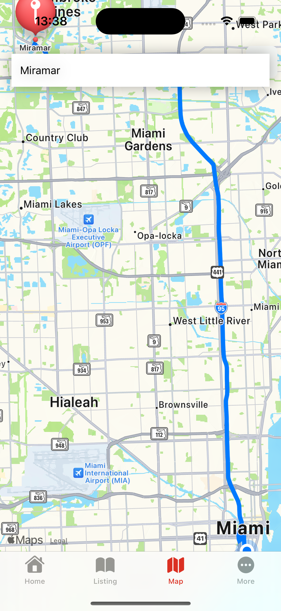 |
| RealEstate Agent Loging | Agent DashBoard | Add Properties(Fields are Validated) |
| 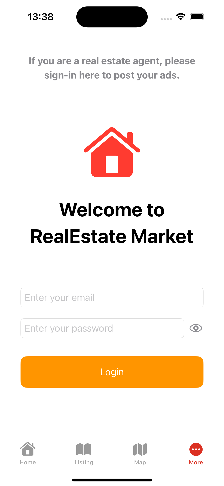 | 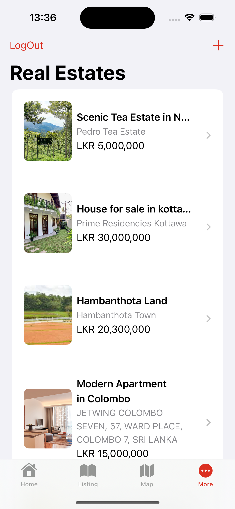 | 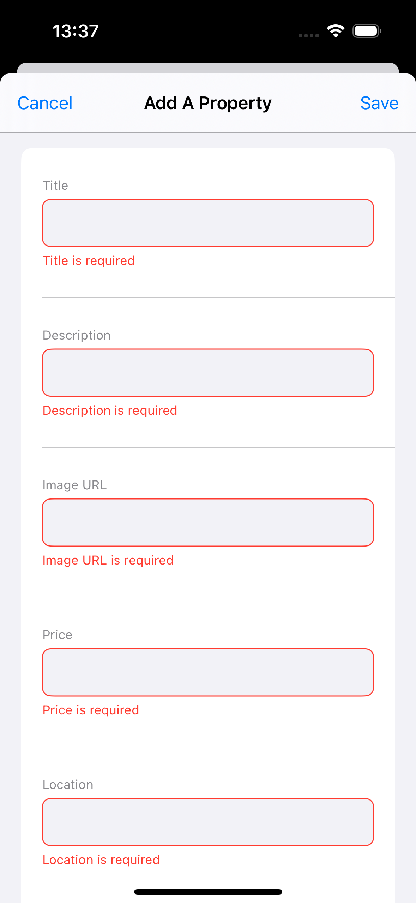 |
| Detail View Listed Properties | Delete Propertie | Edit Properties |
|  | 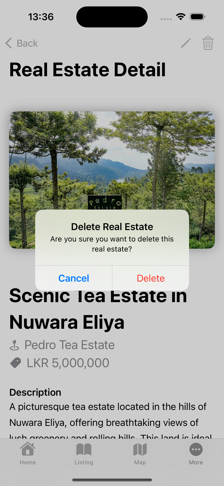 | 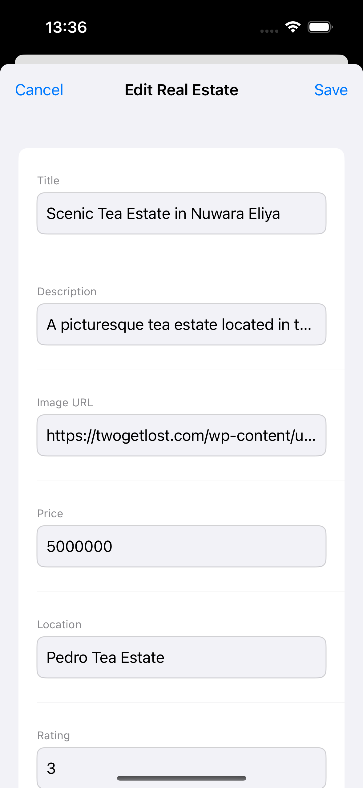 |

## 05. Code Best Practices
The codebase follows consistent naming conventions for variables, uses structures and constants wherever possible, and implements error handling and guard statements to ensure robust functionality. Here is an example:

```swift
struct RealEstate {
    let id: String
    let idUser: String
    let title: String
    let description: String
    let imageURL: String
    let price: Int
    let location: String
    let rating: Int
    let type: String
    let isBest: Bool
    let size: Int
    let bedrooms: Int
    let bathrooms: Int
    let yearBuilt: Int
}

extension RealEstate {
    init?(from data: [String: Any], id: String) {
        guard
            let idUser = data["idUser"] as? String,
            let title = data["title"] as? String,
            let description = data["description"] as? String,
            let imageURL = data["imageURL"] as? String,
            let price = data["price"] as? Int,
            let location = data["location"] as? String,
            let rating = data["rating"] as? Int,
            let type = data["type"] as? String,
            let isBest = data["isBest"] as? Bool,
            let size = data["size"] as? Int,
            let bedrooms = data["bedrooms"] as? Int,
            let bathrooms = data["bathrooms"] as? Int,
            let yearBuilt = data["yearBuilt"] as? Int
        else {
            return nil
        }
        
        self.init(id: id, idUser: idUser, title: title, description: description, imageURL: imageURL, price: price, location: location, rating: rating, type: type, isBest: isBest, size: size, 
                  bedrooms: bedrooms, bathrooms: bathrooms, yearBuilt: yearBuilt)
    }
}
```

## 06. UI Components Used

### The following components were used in the RealEstate Market App:

UIButton: For interactive buttons.
UIAlert: For alert dialogues.
UIViewController: For view controller management.
UINavigationController: For navigation between view controllers.
MapKit: For displaying property locations on a map.
ScrollView: For enabling scrollable content.
HStack: For horizontal stack layouts.
VStack: For vertical stack layouts.
Text: For displaying text.
Image: For displaying images.

## 07. Testing

Unit testing was implemented for the RealEstate struct and the Location struct. These tests ensure that the core functionalities of fetching and displaying property data work correctly.

```swift
func testAddRealEstateSuccess() {
        // Given
        let realEstate = RealEstate(id: "", idUser: "", title: "Test Title", description: "Test Description", imageURL: "", price: 1000, location: "Test Location", rating: 5, type: "Test Type", 
                                    isBest: false, size: 100, bedrooms: 2, bathrooms: 2, yearBuilt: 2020)
        let viewModel = RealEstateViewModel()
        
        // When
        let expectation = self.expectation(description: "Add real estate property")
        viewModel.addRealEstate(realEstate: realEstate) { success, error in
            // Then
            XCTAssertTrue(success)
            XCTAssertNil(error)
            expectation.fulfill()
        }
        
        waitForExpectations(timeout: 5, handler: nil)
}

```

## 08. Documentation

### (a) Design Choices

The app was designed with a focus on user experience and real-time data fetching. The integration with MapKit enhances usability by providing geographical context to property listings. The architecture separates ViewModels and Views to ensure a clear distinction between business logic and UI components, enhancing code maintainability and scalability.

### (b) Implementation Decisions

- **SwiftUI:** Chosen for building the user interface due to its declarative nature and ease of use.
- **Firebase:** Used for the backend to leverage its real-time database capabilities and ease of integration with Swift.
  
### (c) Challenges

- **Real-time Data Synchronization:** Ensuring real-time data synchronization between the app and Firebase.
- **MapKit Integration:** Implementing MapKit integration to show accurate property locations.

## 09. Reflection

### Challenges Faced

- **Learning and Integrating New Frameworks:** Understanding and integrating new frameworks such as MapKit and Firebase.
- **Debugging and Ensuring Smooth Data Flow:** Ensuring smooth data flow between the app and the backend.

### Approach for Future Assignments

- **Detailed Planning:** Start with a more detailed planning phase to outline all features and components.
- **More Time for Testing and Debugging:** Allocate more time for testing and debugging to ensure a smoother development process.
- **Seek Early Feedback:** Seek feedback from peers and mentors early in the development process to identify potential issues and improvements.
